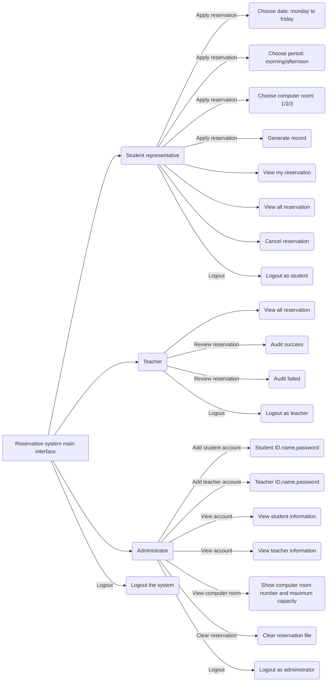

# Computer Room Reservation Management System Requirement

### 1. Identity introduction
- Student representative:  apply for a computer room
- Teacher:  review students' reservation requests 
- Administrator:  create account for students and teachers

### 2. Computer room introduction
- Room 1:  maximum capacity of 12 people
- Room 2:  maximum capacity of 50 people
- Room 3:  maximum capacity of 100 people

### 3. Reservation introduction
- The reservations is cleared by the administrator every week
- Students can book a computer room for the next week, reservation date is monday to friday
- Teachers have to review the reservations, review the reservations according to the actual situation

### 4. The functions that need to be implemented in the system are as follows：

### First enter the login interface, the login identity that can be chosen:
- Student representative
- Teacher
- Administrator
- Quit system

### Each identity needs to be verified, then enter the submenu
- Student login requires: student ID, name, password
- Teacher login requires: teacher ID, name, password
- Administrator login requires: name, password

### Student
- Apply for reservation: apply for the computer room
- View my reservation
- View all reservation
- Cancel reservation
- Logout

### Teacher
- View all reservation
- Review reservation
- Logout

### Administrator
- Add account
- View account
- View computer room
- Clear reservation
- Logout

### 5. Flow chart

